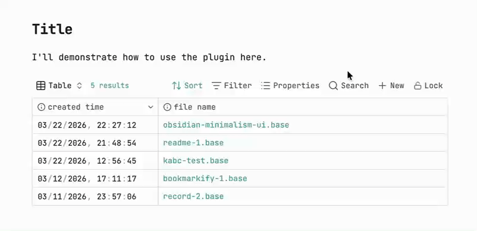

<div align="center">中文 ｜ <a href="../README.md">English</a></div>

<br><br>

**Bases Lock** 是一个 Obsidian 小插件，可以 **按需隐藏 Bases 顶部操作栏（toolbar）并禁用表头交互**，让页面更简洁，同时避免误操作。

**注意：** 插件仅在 **阅读模式** 下生效，且 **仅支持桌面端**。



## ⭐ 使用方法

1. 在 **阅读模式** 下打开一篇嵌入了 Base 的笔记。
2. 将鼠标悬停在 Base 上，右上角会出现「锁定」按钮。
3. 点击按钮，即可在 **锁定** 与 **解锁** 之间切换。

锁定后：

- 隐藏 Bases 操作栏
- 禁止表头（列）交互
- 只影响当前文档中的 `.base` 引用，不会扫描或修改其他笔记

## ⬇️ 安装

1. 打开 Obsidian，进入 **设置 → 社区插件**
2. 点击 **浏览**，搜索 **"Bases lock"**
3. 点击 **安装**，然后启用该插件
4. 确保官方 **Bases** 核心插件也已启用

也可以直接通过这个链接安装：[点击安装](https://community.obsidian.md/plugins/bases-lock)

## ❓ 工作原理

点击锁定按钮后，插件会改写笔记中该 Base 的嵌入语法，因此锁定/解锁状态会随笔记一起保存。

例如，`src/a.base` 以下列任意形式被引用：

- `![[src/a.base]]`
- ``
- ``

点击 **锁定** 后，都会被统一改写为：

```markdown

```

（如果原本没有显示名称，会自动使用文件名作为名称，例如 `![[src/a.base]]` → ``。）

再次点击 **解锁** 后，会变为：

```markdown

```

简单来说：

- `|x` → 隐藏操作栏、禁止表头交互，按钮显示 **locked**
- `|o` → 恢复操作栏和表头交互，按钮显示 **unlocked**

### 页面内 base 代码块

Base 也可以直接以代码块的形式写在笔记正文中：

````markdown
```base
views:
  - type: table
```
````

插件同样支持这种写法。锁定时会在围栏语言标记后追加一个 `x` 标记：

````markdown
```base x
views:
  - type: table
```
````

解锁时会去掉该标记。每个代码块的锁定状态相互独立，因此同一篇笔记里可以同时混用 `.base` 文件嵌入和页面内 base 代码块。

